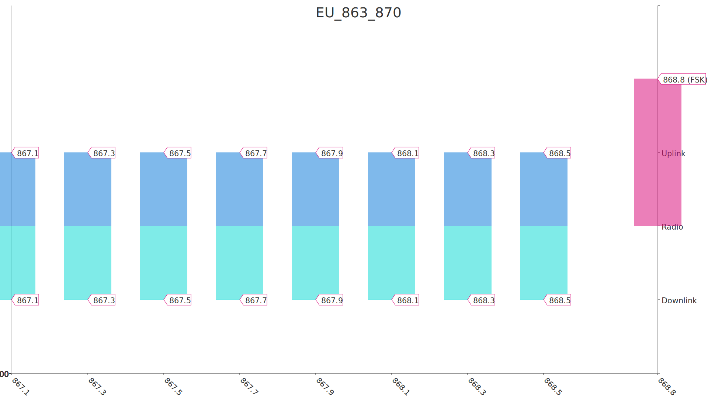
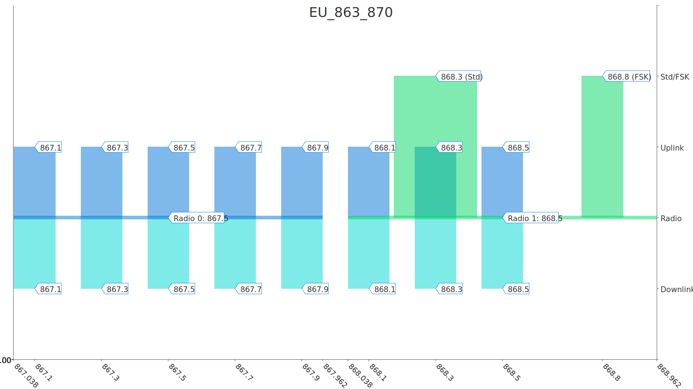

# LoRaWAN Frequency Plans for The Things Stack

# End device frequency plans

## [`EU_863_870`](../end-device/EU_863_870.yml): Europe 863-870 MHz 

>> Default frequency plan for Europe

## `EU_863_870_TTN`: Europe 863-870 MHz
Based on [EU_863_870](##EU_863_870) and modified by [rx2_default_data_rata_3.yml](../end-device/modifiers/rx2_default_data_rata_3.yml)
 

>> TTN Community Network frequency plan for Europe, using SF9 for RX2

# Gateway frequency plans

## [`EU_863_870`](../gateway/EU_863_870.yml): Europe 863-870 MHz 

>> Default frequency plan for Europe

