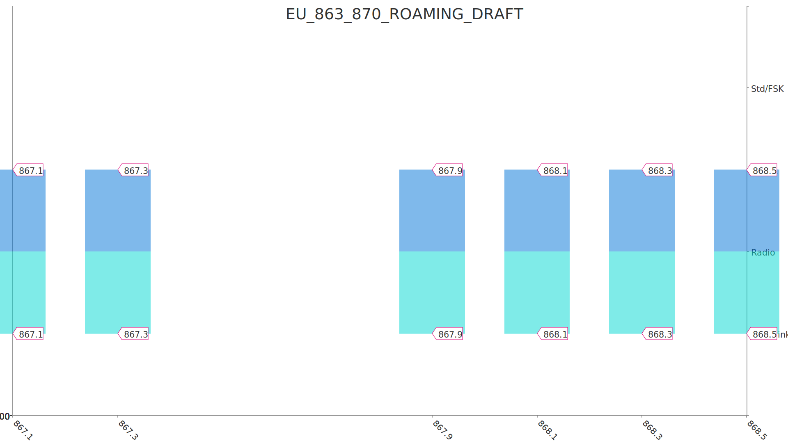
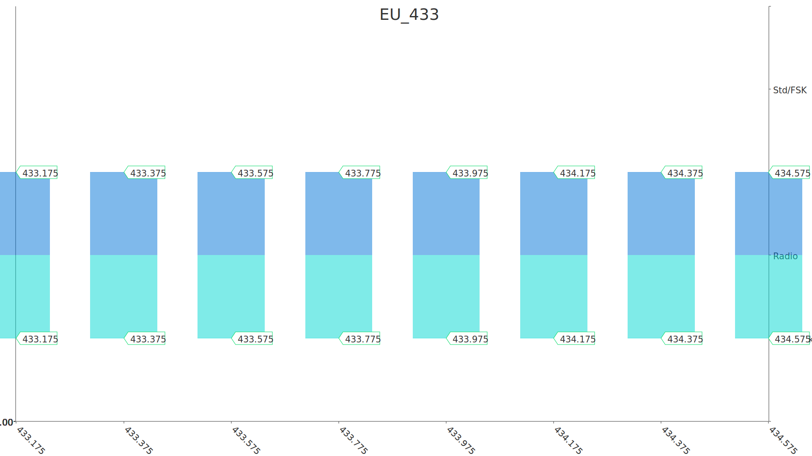
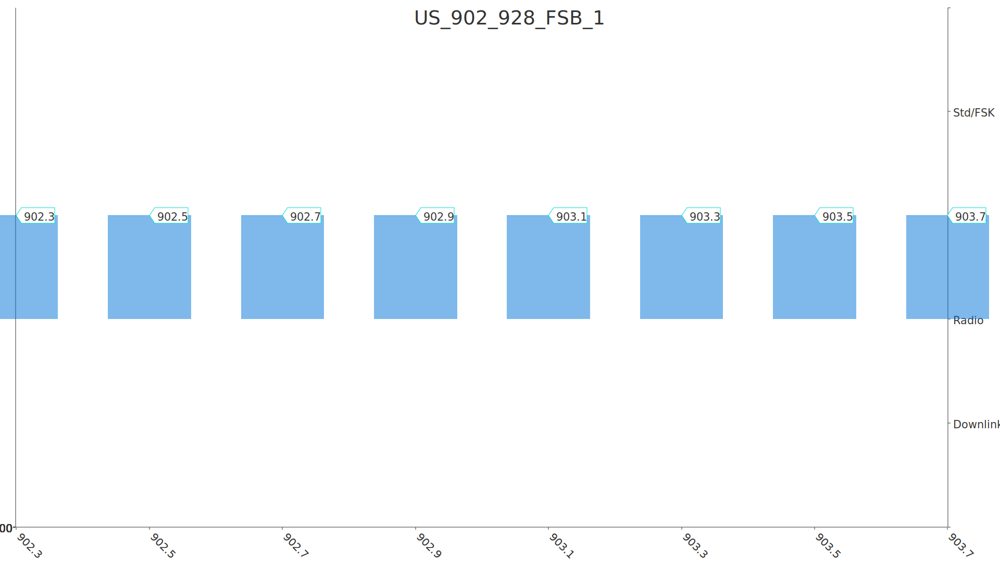
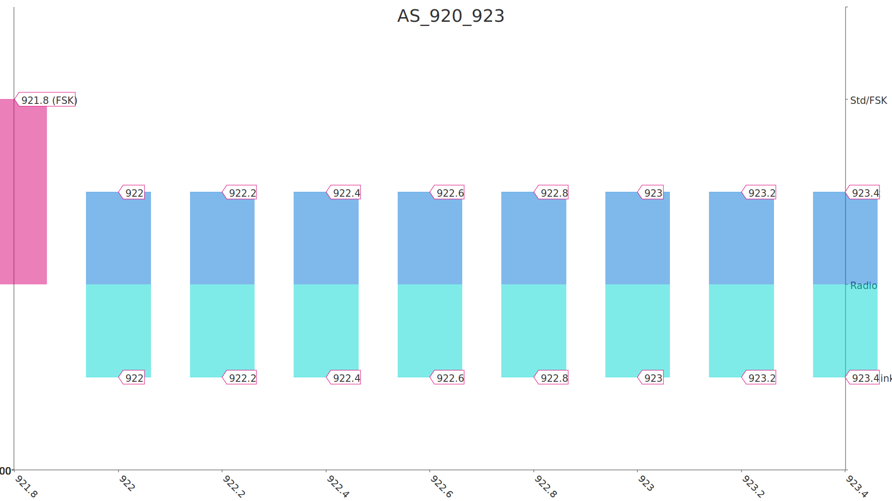
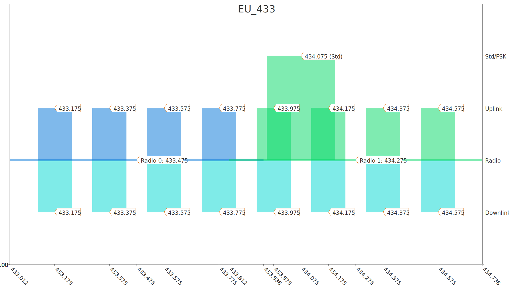
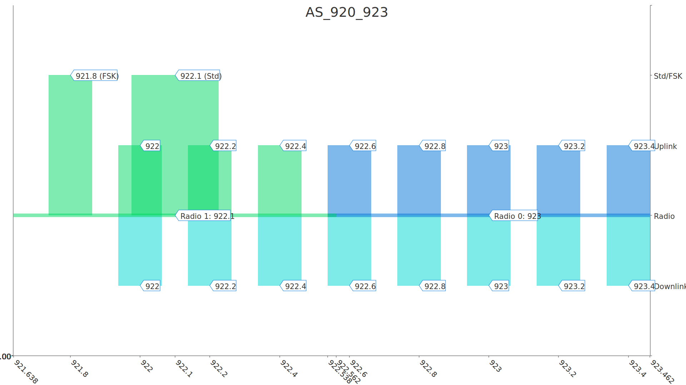
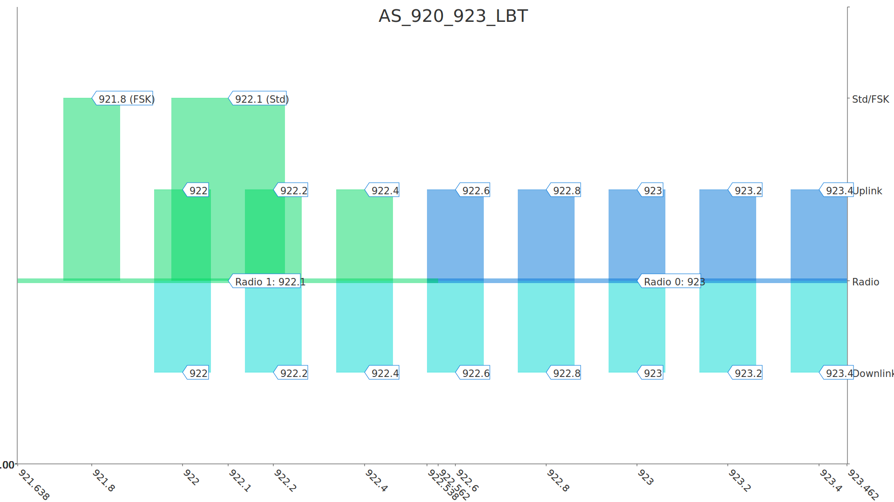

# LoRaWAN Frequency Plans for The Things Stack

# End device frequency plans

## [`EU_863_870`](../end-device/EU_863_870.yml): Europe 863-870 MHz 

>> Default frequency plan for Europe

## `EU_863_870_TTN`: Europe 863-870 MHz
Based on [EU_863_870](##EU_863_870) and modified by [rx2_default_data_rata_3.yml](../end-device/modifiers/rx2_default_data_rata_3.yml) 

>> TTN Community Network frequency plan for Europe, using SF9 for RX2

## [`EU_863_870_ROAMING_DRAFT`](../end-device/EU_863_870_ROAMING_DRAFT.yml): Europe 863-870 MHz, 6 channels for roaming (Draft) 

>> European 6 channel plan used by major operators to support LoRaWAN Passive Roaming

## [`EU_433`](../end-device/EU_433.yml): Europe 433 MHz (ITU region 1) 

>> Default frequency plan for worldwide 433MHz

## [`US_902_928_FSB_1`](../end-device/US_902_928_FSB_1.yml): United States 902-928 MHz, FSB 1 

>> Default frequency plan for the United States and Canada, using sub-band 1

## [`AS_920_923`](../end-device/AS_920_923.yml): Asia 920-923 MHz 

>> TTN Community Network frequency plan for Asian countries, using frequencies ≤ 923 MHz

## `AS_920_923_LBT`: Asia 920-923 MHz with LBT
Based on [AS_920_923](##AS_920_923) and modified by [lbt_80_over_128.yml](../end-device/modifiers/lbt_80_over_128.yml) 

>> TTN Community Network frequency plan for Asian countries, using frequencies ≤ 923 MHz with listen-before-talk

# Gateway frequency plans

## [`EU_863_870`](../gateway/EU_863_870.yml): Europe 863-870 MHz 

>> Default frequency plan for Europe

## [`EU_433`](../gateway/EU_433.yml): Europe 433 MHz (ITU region 1) 

>> Default frequency plan for worldwide 433MHz

## [`AS_920_923`](../gateway/AS_920_923.yml): Asia 920-923 MHz 

>> TTN Community Network frequency plan for Asian countries, using frequencies ≤ 923 MHz

## `AS_920_923_LBT`: Asia 920-923 MHz with LBT
Based on AS_920_923 and modified by [lbt_80_over_128.yml](../gateway/modifiers/lbt_80_over_128.yml)
 

>> TTN Community Network frequency plan for Asian countries, using frequencies ≤ 923 MHz with listen-before-talk

