# LoRaWAN Frequency Plans for The Things Stack

## `EU_863_870`: Europe 863-870 MHz (SF12 for RX2)

> Default frequency plan for Europe

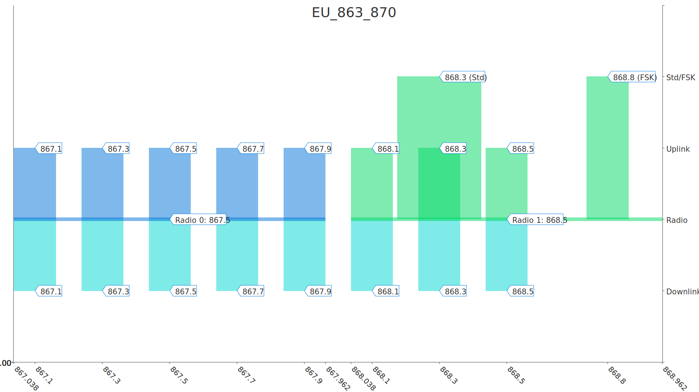

## `EU_863_870_TTN`: Europe 863-870 MHz (SF9 for RX2 - recommended)

> TTN Community Network frequency plan for Europe, using SF9 for RX2

## `EU_863_870_ROAMING_DRAFT`: Europe 863-870 MHz, 6 channels for roaming (Draft)

> European 6 channel plan used by major operators to support LoRaWAN Passive Roaming

## `EU_433`: Europe 433 MHz (ITU region 1)

> Default frequency plan for worldwide 433MHz

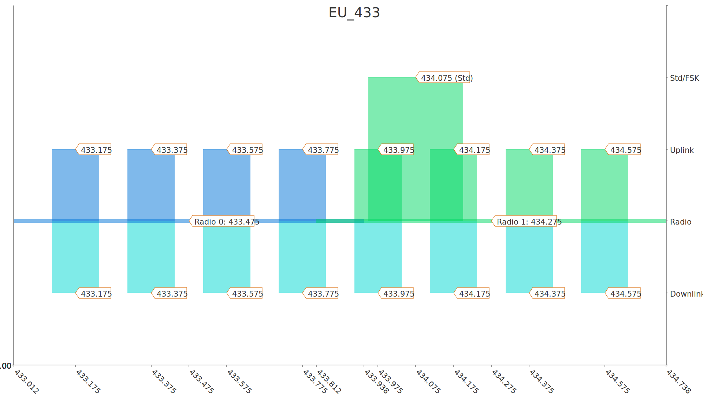

## `US_902_928_FSB_1`: United States 902-928 MHz, FSB 1

> Default frequency plan for the United States and Canada, using sub-band 1

## `US_902_928_FSB_2`: United States 902-928 MHz, FSB 2 (used by TTN)

> TTN Community Network frequency plan for the United States and Canada, using sub-band 2

## `US_902_928_FSB_3`: United States 902-928 MHz, FSB 3

> Default frequency plan for the United States and Canada, using sub-band 3

## `US_902_928_FSB_4`: United States 902-928 MHz, FSB 4

> Default frequency plan for the United States and Canada, using sub-band 4

## `US_902_928_FSB_5`: United States 902-928 MHz, FSB 5

> Default frequency plan for the United States and Canada, using sub-band 5

## `US_902_928_FSB_6`: United States 902-928 MHz, FSB 6

> Default frequency plan for the United States and Canada, using sub-band 6

## `US_902_928_FSB_7`: United States 902-928 MHz, FSB 7

> Default frequency plan for the United States and Canada, using sub-band 7

## `US_902_928_FSB_8`: United States 902-928 MHz, FSB 8

> Default frequency plan for the United States and Canada, using sub-band 8

## `AU_915_928_FSB_1`: Australia 915-928 MHz, FSB 1

> Default frequency plan for Australia, using sub-band 1

## `AU_915_928_FSB_2`: Australia 915-928 MHz, FSB 2 (used by TTN)

> TTN Community Network frequency plan for Australia, using sub-band 2

## `AU_915_928_FSB_3`: Australia 915-928 MHz, FSB 3

> Default frequency plan for Australia, using sub-band 3

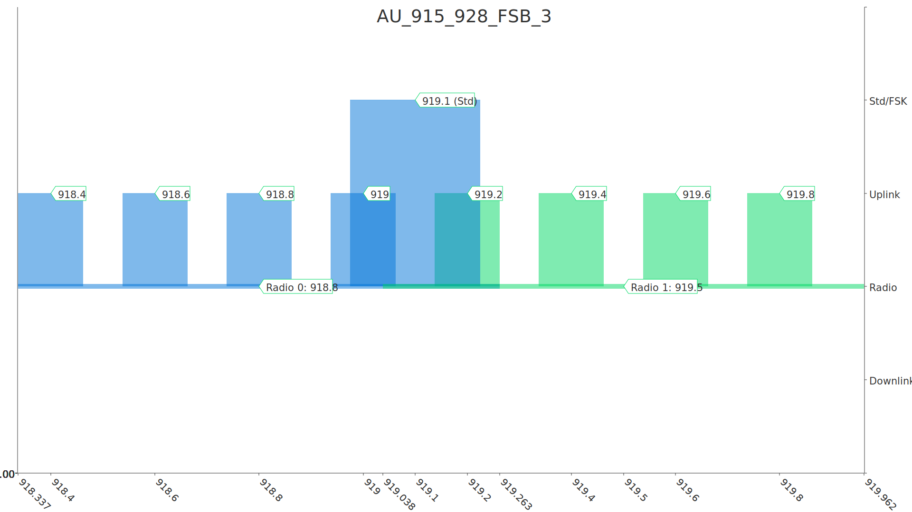

## `AU_915_928_FSB_4`: Australia 915-928 MHz, FSB 4

> Default frequency plan for Australia, using sub-band 4

## `AU_915_928_FSB_5`: Australia 915-928 MHz, FSB 5

> Default frequency plan for Australia, using sub-band 5

## `AU_915_928_FSB_6`: Australia 915-928 MHz, FSB 6

> Frequency plan for Australia, using sub-band 6, which overlaps with Asia 923-925 MHz

## `AU_915_928_FSB_7`: Australia 915-928 MHz, FSB 7

> Default frequency plan for Australia, using sub-band 7

## `AU_915_928_FSB_8`: Australia 915-928 MHz, FSB 8

> Default frequency plan for Australia, using sub-band 8

## `CN_470_510_FSB_1`: China 470-510 MHz, FSB 1

> Default frequency plan for China, using sub-band 1

## `CN_470_510_FSB_11`: China 470-510 MHz, FSB 11 (used by TTN)

> TTN Community Network frequency plan for China, using sub-band 11

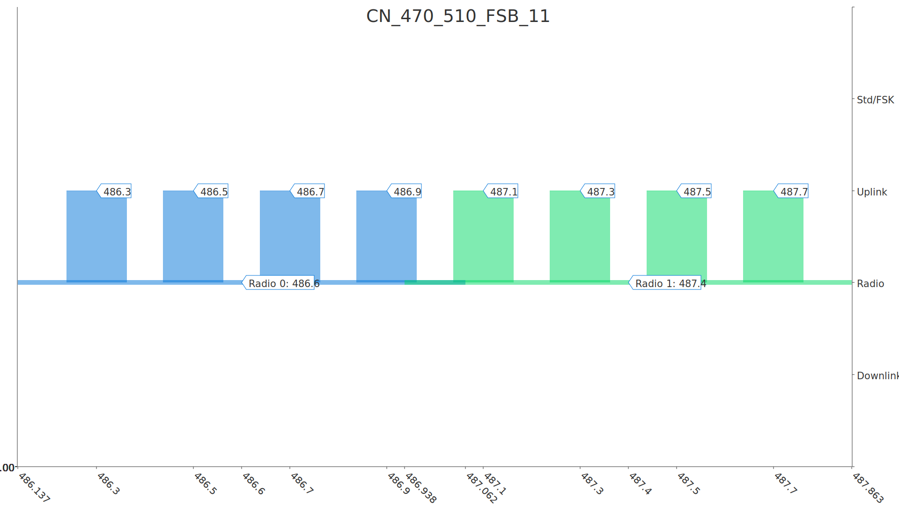

## `AS_920_923`: Asia 920-923 MHz

> TTN Community Network frequency plan for Asian countries, using frequencies ≤ 923 MHz

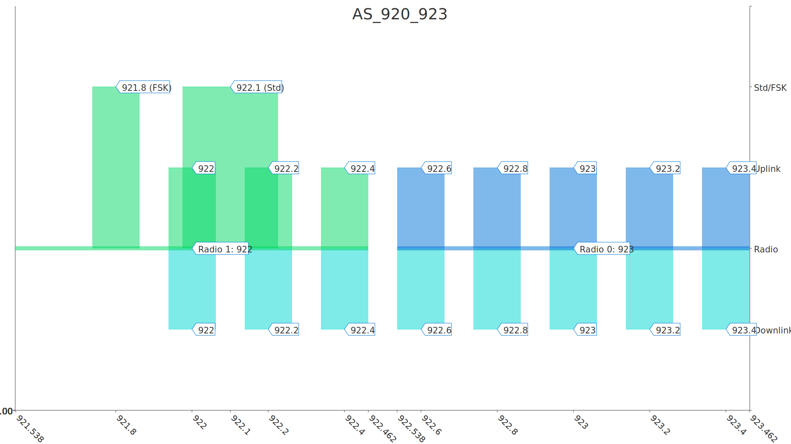

## `AS_920_923_LBT`: Asia 920-923 MHz with LBT

> TTN Community Network frequency plan for Asian countries, using frequencies ≤ 923 MHz with listen-before-talk

## `AS_920_923_TTN_JP_1`: Japan 920-923 MHz with LBT (channels 31-38)

> Frequency plan for Japan, using continuous frequencies up to 923.4MHz with LBT.

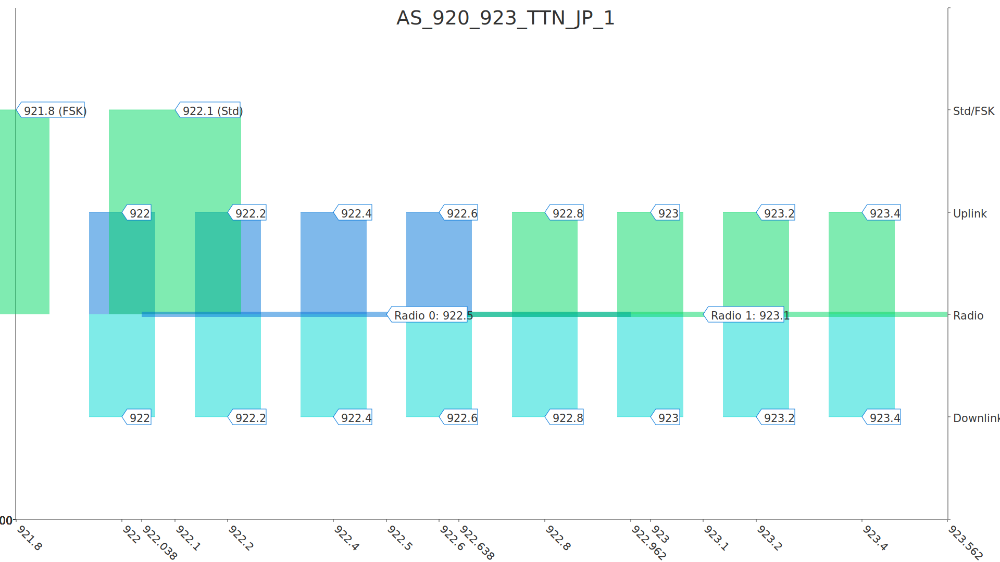

## `AS_920_923_TTN_JP_1_LAND_MOBILE`: Japan 920-923 MHz with LBT (channels 31-38), Max EIRP 27 dBm

> Frequency plan for Japanese land mobile station, using continuous frequencies up to 923.4MHz with MAX EIRP 27 dBm and LBT.
(note) A user who installs land mobile station in Japan must apply to Japanese Ministry of Internal Affairs and Communications.

## `AS_920_923_TTN_JP_2`: Japan 920-923 MHz with LBT (channels 24-27 and 35-38)

> Frequency plan for Japan, using top and bottom frequencies ≤ 923.4 MHz with LBT.

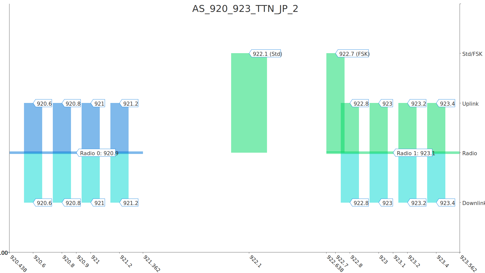

## `AS_920_923_TTN_JP_3`: Japan 920-923 MHz with LBT (channels 24-31)

> Frequency plan for Japan (16 channels), using continuous frequencies from 920.6 MHz, expected to be used with AS_920_923_TTN_JP_1.

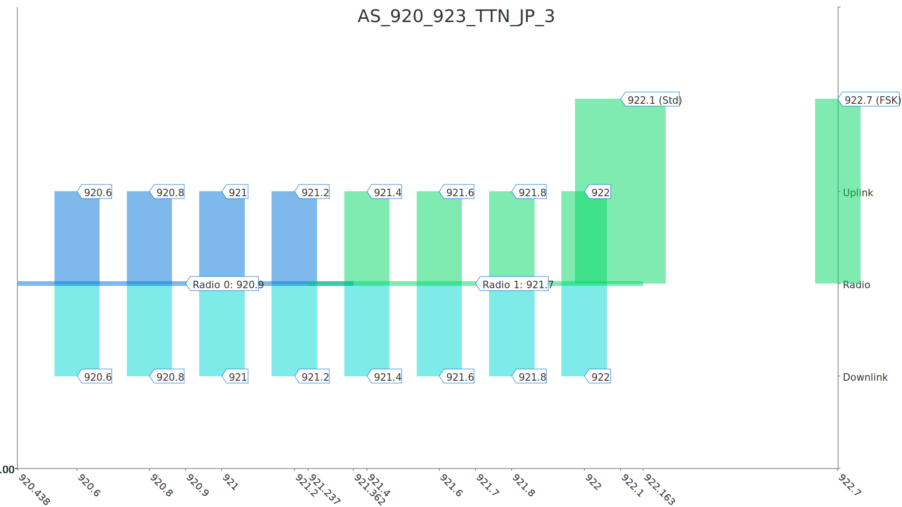

## `AS_920_923_TTN_JP_3_LAND_MOBILE`: Japan 920-923 MHz with LBT (channels 24-31), Max EIRP 27 dBm

> Frequency plan for Japanese land mobile station (16 channels), using continuous frequencies from 920.6 MHz with MAX EIRP 27 dBm and LBT, expected to be used with AS_920_923_TTN_JP_1.
(note) A user who installs land mobile station in Japan must apply to Japanese Ministry of Internal Affairs and Communications.

## `AS_923`: Asia 915-928 MHz (AS923 Group 1) with only default channels

> Compatibility frequency plan for Asian countries with common channels in the 923.0-923.5 MHz sub-band

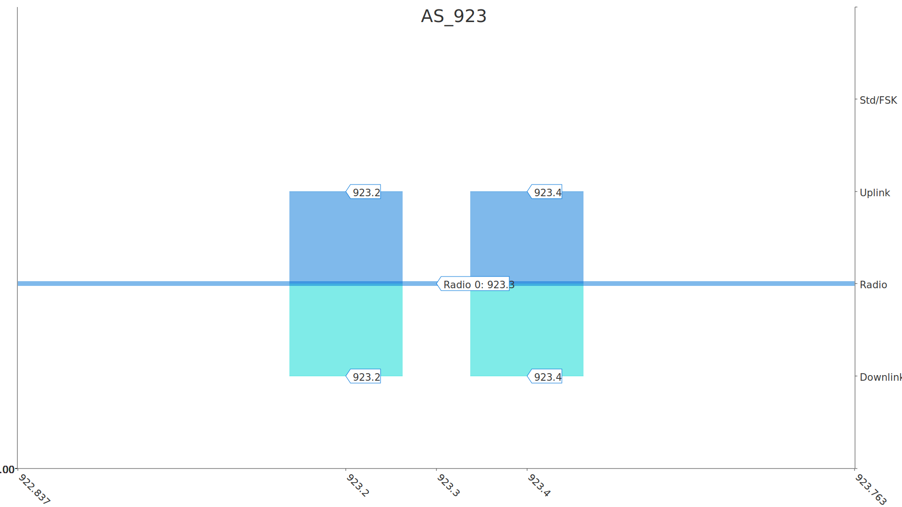

## `AS_923_2`: Asia 920-923 MHz (AS923 Group 2) with only default channels

> Compatibility frequency plan for Asian countries with common channels in the 921.4-922.0 MHz sub-band

## `AS_923_3`: Asia 915-921 MHz (AS923 Group 3) with only default channels

> Compatibility frequency plan for Asian countries with common channels in the 916.5-917.0 MHz sub-band

## `AS_923_4`: Asia 917-920 MHz (AS923 Group 4) with only default channels

> Compatibility frequency plan for Asian countries with common channels in the 917.3-917.5 MHz sub-band

## `AS_923_NDT`: Asia 915-928 MHz (AS923 Group 1) with only default channels and dwell time disabled

> Compatibility frequency plan for Asian countries with common channels in the 923.0-923.5 MHz sub-band and dwell time disabled

## `AS_923_DT`: Asia 915-928 MHz (AS923 Group 1) with only default channels and dwell time enabled

> Compatibility frequency plan for Asian countries with common channels in the 923.0-923.5 MHz sub-band and dwell time enabled

## `AS_923_2_NDT`: Asia 920-923 MHz (AS923 Group 2) with only default channels and dwell time disabled

> Compatibility frequency plan for Asian countries with common channels in the 921.4-922.0 MHz sub-band and dwell time disabled

## `AS_923_2_DT`: Asia 920-923 MHz (AS923 Group 2) with only default channels and dwell time enabled

> Compatibility frequency plan for Asian countries with common channels in the 921.4-922.0 MHz sub-band and dwell time enabled

## `AS_923_3_NDT`: Asia 920-923 MHz (AS923 Group 3) with only default channels and dwell time disabled

> Compatibility frequency plan for Asian countries with common channels in the 921.4-922.0 MHz sub-band and dwell time disabled

## `AS_923_3_DT`: Asia 920-923 MHz (AS923 Group 3) with only default channels and dwell time enabled

> Compatibility frequency plan for Asian countries with common channels in the 921.4-922.0 MHz sub-band and dwell time enabled

## `AS_923_4_NDT`: Asia 920-923 MHz (AS923 Group 4) with only default channels and dwell time disabled

> Compatibility frequency plan for Asian countries with common channels in the 921.4-922.0 MHz sub-band and dwell time disabled

## `AS_923_4_DT`: Asia 920-923 MHz (AS923 Group 4) with only default channels and dwell time enabled

> Compatibility frequency plan for Asian countries with common channels in the 921.4-922.0 MHz sub-band and dwell time enabled

## `AS_923_925`: Asia 923-925 MHz

> TTN Community Network frequency plan for Asian countries, using frequencies ≥ 923 MHz

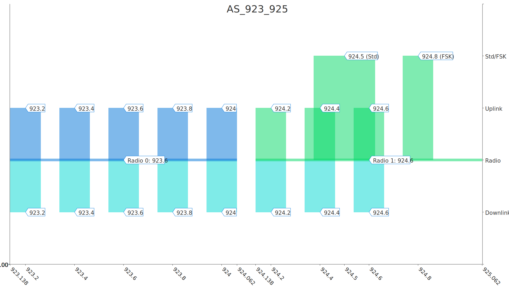

## `AS_923_925_LBT`: Asia 923-925 MHz with LBT

> TTN Community Network frequency plan for Asian countries, using frequencies ≥ 923 MHz with listen-before-talk

## `AS_920_923_TTN_AU`: Asia 920-923 MHz (used by TTN Australia)

> TTN Community Network frequency plan for Asia 920-923 MHz in Australia

## `AS_923_925_TTN_AU`: Asia 923-925 MHz (used by TTN Australia - secondary channels)

> TTN Community Network frequency plan for Asia 923-925 MHz in Australia. Secondary channels for 16 channel gateways.

## `KR_920_923_TTN`: South Korea 920-923 MHz

> TTN Community Network frequency plan for South Korea

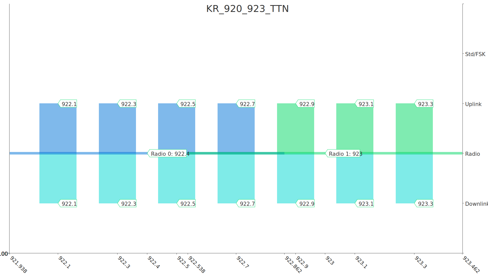

## `IN_865_867`: India 865-867 MHz

> Default frequency plan for India

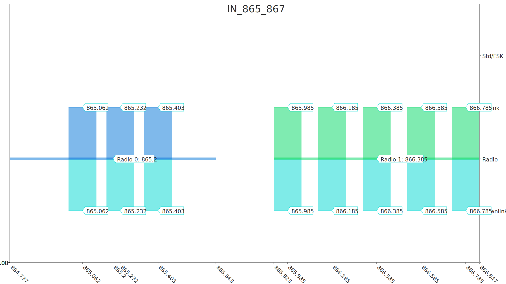

## `RU_864_870_TTN`: Russia 864-870 MHz

> TTN Community Network frequency plan for Russia

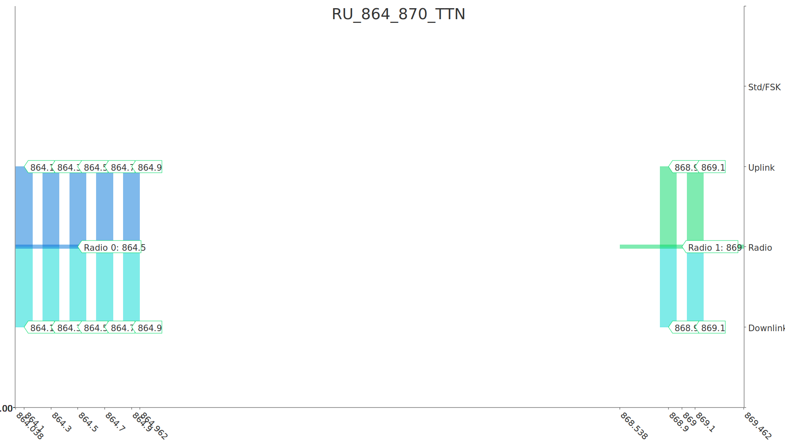

## `ISM_2400_3CH_DRAFT2`: LoRa 2.4 GHz with 3 channels (Draft 2)

> Global 3 channel plan for LoRa 2.4 GHz (Draft 2)

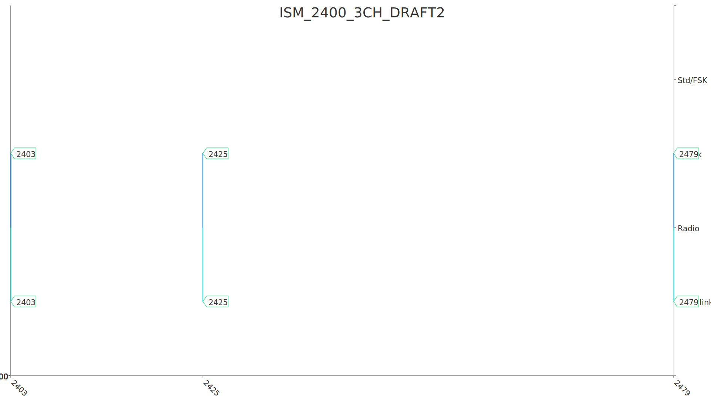

